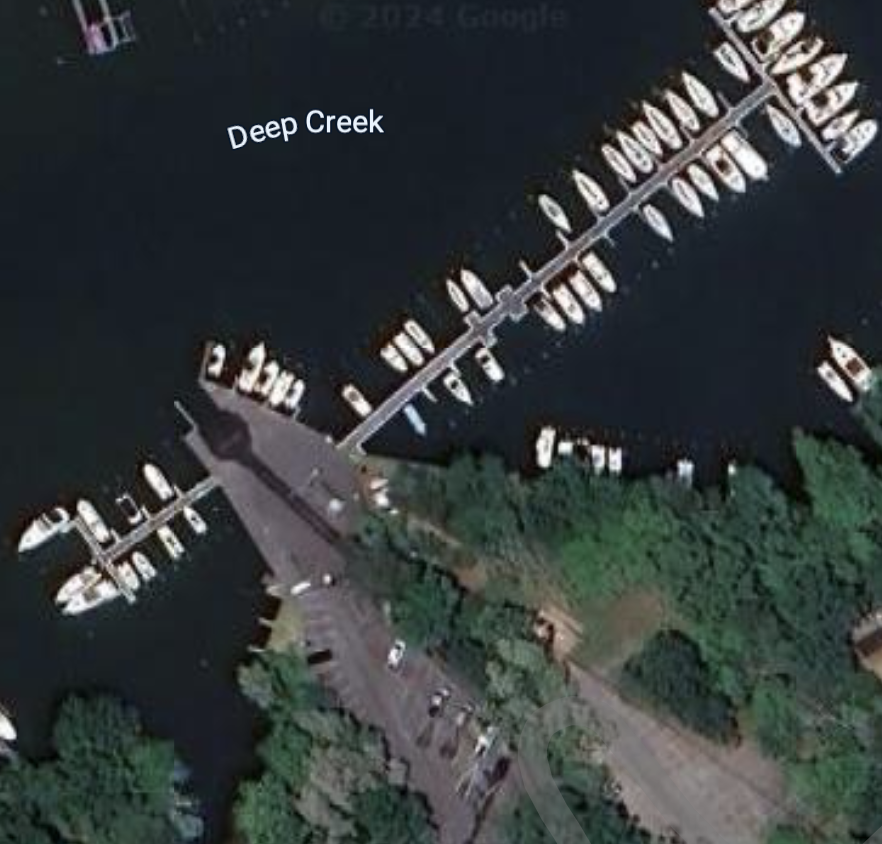

### Boat Ramp

  
  <pre>
{
  name: 'Boat Ramp',
  imageSrc: 'path/to/boat-ramp-image.jpg',
  website: 'https://cscia.org/cscia-services/boat-slips-information/',
  description: 'This is a detailed description of the boat ramp. It provides extensive information about its history and services.',
  hours: [
    'Monday: 9:00 AM - 5:00 PM',
    'Tuesday: 9:00 AM - 5:00 PM',
    'Wednesday: 9:00 AM - 5:00 PM',
    'Thursday: 9:00 AM - 5:00 PM',
    'Friday: 9:00 AM - 5:00 PM',
    'Saturday: Closed',
    'Sunday: Closed'
  ],
  relatedKeywords: ['boat ramp', 'history', 'services'],
  cameraPosition: [15, 0, 25],
  orbitTarget: [15, 0, 0],
  fov: 80,
  color: '#0000ff',
  secondaryColor: '#ff00ff'
}
  </pre>

