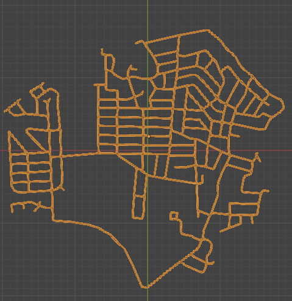

# Cape St. Claire, Maryland 3D Web Application

To structure this project we divided the neighborhood of Cape St. Claire into four quadrants.

<div align="center">
  
</div>


I then listed key locations that fall into each quadrant which will eventually become it's own React component. I also have a 'Global Quadrant" that appear in all of the quadrants.
<div align="center">

| Quadrant 1      | Quadrant 2  | Quadrant 3           | Quadrant 4           |
| --------------- | ----------- | -------------------- | -------------------- |
| Main Beach      | Lake Claire | Broadneck Highschool | Cape Shopping Center |
| Cape Club House | Boat Ramp   | Broadneck Library    | Cape Field           |
| Bay             | Deep Creek  | Broadneck Athletics  | Fire House           |
|                 |             |                      | CSC Elementary       |
|                 |             |                      | Guard House          |
|                 |             |                      | Goshen Farm          |
|                 |             |                      | Little Magothy Park  |
|                 |             |                      | Little Magothy       |
</div>
And the additional global assets are:
- Streets
- Houses
- Floor

As well as global UI components:
- Model.jsx
- Nav.jsx
  - WeatherCard.jsx

Each location has it's properties defined in a data file specified for that quadrant. The data file is made up of an array of objects.
For example:
```
const quadrant1Data = [
  {
    name: 'Main Beach',
    imageSrc: mainbeachImage,
    position: [1.9, 0.02, -0.4],
    spotlightPosition: [1.9, .5, -0.4],
    cameraPosition: [2.7, .5, -1.0],
    orbitTarget: [1.9, 0.02, -0.4],
    fov: 20,
    color: '#EFDD6F',
    secondaryColor: '#ff6347',
    modelPath: modelPaths.mainBeach,
    website: "https://cscia.org/cscia-services/beaches/",
    description: 'Main Beach is a popular destination for beachgoers, offering sandy shores and refreshing waters for swimming and sunbathing.',
  },

  {
    name: 'Cape Club House',
    imageSrc: capeclubhouseImage,
    position: [1.65, 0.02, -0.35],
    spotlightPosition: [1.65, 0.52, -0.35],
    cameraPosition: [2, .3, 0],
    orbitTarget: [1.65, 0.02, -0.35],
    fov: 30,
    color: '#DDE0E6',
    secondaryColor: '#5f9ea0',
    modelPath: modelPaths.capeClubHouse,
    website: 'https://cscia.org/',
    description: 'The Cape St. Claire Improvement Association manages the affairs of the community, administers the Special Community Benefit District, and publishes the community newsletter the Caper.'
  },
  // {
  //   name: 'Bay',
  //   position: [1.45, 0.03, -1.25],
  //   color: '#4682b4',
  //   secondaryColor: '#5f9ea0',
  // }
];

export default quadrant1Data;
```